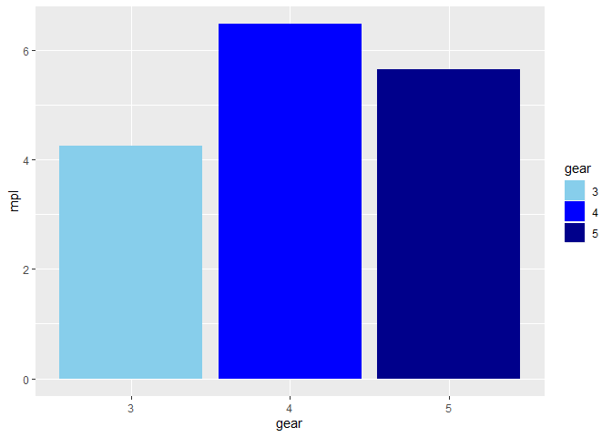

Pre-class 1 Exercises
---------------------

The warm-up for class will use the mtcars dataset which is always
present in R. The following code shows you how load the dataset

``` r
pacman::p_load(pacman, tidyverse) #laod packages
? mtcars # what are the variables
```

    ## starting httpd help server ... done

``` r
cars <- mtcars %>% rownames_to_column(var = "type") # tranform to tibble
```

This a brief re-introduction to the tidyverse package in R

This is something we went through during 1st semester so you should be
able to do it, however if the summer have been to harsh I recommend
consulting R for data science chapter 5:
<a href="https://r4ds.had.co.nz" class="uri">https://r4ds.had.co.nz</a>

``` r
# Using mutate - convert miles per gallon to liters
cars<-mutate(cars,mpl=mpg/3.78541)
# Using filter - find all the cars which have more that 4 gears and are automatic
filter(cars,gear>=4,am==0)
```

    ##        type  mpg cyl  disp  hp drat   wt qsec vs am gear carb      mpl
    ## 1 Merc 240D 24.4   4 146.7  62 3.69 3.19 20.0  1  0    4    2 6.445801
    ## 2  Merc 230 22.8   4 140.8  95 3.92 3.15 22.9  1  0    4    2 6.023126
    ## 3  Merc 280 19.2   6 167.6 123 3.92 3.44 18.3  1  0    4    4 5.072106
    ## 4 Merc 280C 17.8   6 167.6 123 3.92 3.44 18.9  1  0    4    4 4.702265

``` r
# Using select - create a column dataframe with only miles pr. gallon, weight and number og gears
cars2<-cars %>% select(mpg,wt,gear)
# Using arrange - What cars are most fuel efficient? (lowest miles pr. liter/gallon)
cars %>% arrange(desc(mpl))
```

    ##                   type  mpg cyl  disp  hp drat    wt  qsec vs am gear carb
    ## 1       Toyota Corolla 33.9   4  71.1  65 4.22 1.835 19.90  1  1    4    1
    ## 2             Fiat 128 32.4   4  78.7  66 4.08 2.200 19.47  1  1    4    1
    ## 3          Honda Civic 30.4   4  75.7  52 4.93 1.615 18.52  1  1    4    2
    ## 4         Lotus Europa 30.4   4  95.1 113 3.77 1.513 16.90  1  1    5    2
    ## 5            Fiat X1-9 27.3   4  79.0  66 4.08 1.935 18.90  1  1    4    1
    ## 6        Porsche 914-2 26.0   4 120.3  91 4.43 2.140 16.70  0  1    5    2
    ## 7            Merc 240D 24.4   4 146.7  62 3.69 3.190 20.00  1  0    4    2
    ## 8           Datsun 710 22.8   4 108.0  93 3.85 2.320 18.61  1  1    4    1
    ## 9             Merc 230 22.8   4 140.8  95 3.92 3.150 22.90  1  0    4    2
    ## 10       Toyota Corona 21.5   4 120.1  97 3.70 2.465 20.01  1  0    3    1
    ## 11      Hornet 4 Drive 21.4   6 258.0 110 3.08 3.215 19.44  1  0    3    1
    ## 12          Volvo 142E 21.4   4 121.0 109 4.11 2.780 18.60  1  1    4    2
    ## 13           Mazda RX4 21.0   6 160.0 110 3.90 2.620 16.46  0  1    4    4
    ## 14       Mazda RX4 Wag 21.0   6 160.0 110 3.90 2.875 17.02  0  1    4    4
    ## 15        Ferrari Dino 19.7   6 145.0 175 3.62 2.770 15.50  0  1    5    6
    ## 16            Merc 280 19.2   6 167.6 123 3.92 3.440 18.30  1  0    4    4
    ## 17    Pontiac Firebird 19.2   8 400.0 175 3.08 3.845 17.05  0  0    3    2
    ## 18   Hornet Sportabout 18.7   8 360.0 175 3.15 3.440 17.02  0  0    3    2
    ## 19             Valiant 18.1   6 225.0 105 2.76 3.460 20.22  1  0    3    1
    ## 20           Merc 280C 17.8   6 167.6 123 3.92 3.440 18.90  1  0    4    4
    ## 21          Merc 450SL 17.3   8 275.8 180 3.07 3.730 17.60  0  0    3    3
    ## 22          Merc 450SE 16.4   8 275.8 180 3.07 4.070 17.40  0  0    3    3
    ## 23      Ford Pantera L 15.8   8 351.0 264 4.22 3.170 14.50  0  1    5    4
    ## 24    Dodge Challenger 15.5   8 318.0 150 2.76 3.520 16.87  0  0    3    2
    ## 25         Merc 450SLC 15.2   8 275.8 180 3.07 3.780 18.00  0  0    3    3
    ## 26         AMC Javelin 15.2   8 304.0 150 3.15 3.435 17.30  0  0    3    2
    ## 27       Maserati Bora 15.0   8 301.0 335 3.54 3.570 14.60  0  1    5    8
    ## 28   Chrysler Imperial 14.7   8 440.0 230 3.23 5.345 17.42  0  0    3    4
    ## 29          Duster 360 14.3   8 360.0 245 3.21 3.570 15.84  0  0    3    4
    ## 30          Camaro Z28 13.3   8 350.0 245 3.73 3.840 15.41  0  0    3    4
    ## 31  Cadillac Fleetwood 10.4   8 472.0 205 2.93 5.250 17.98  0  0    3    4
    ## 32 Lincoln Continental 10.4   8 460.0 215 3.00 5.424 17.82  0  0    3    4
    ##         mpl
    ## 1  8.955437
    ## 2  8.559179
    ## 3  8.030834
    ## 4  8.030834
    ## 5  7.211900
    ## 6  6.868477
    ## 7  6.445801
    ## 8  6.023126
    ## 9  6.023126
    ## 10 5.679702
    ## 11 5.653285
    ## 12 5.653285
    ## 13 5.547616
    ## 14 5.547616
    ## 15 5.204192
    ## 16 5.072106
    ## 17 5.072106
    ## 18 4.940020
    ## 19 4.781516
    ## 20 4.702265
    ## 21 4.570179
    ## 22 4.332424
    ## 23 4.173920
    ## 24 4.094669
    ## 25 4.015417
    ## 26 4.015417
    ## 27 3.962583
    ## 28 3.883331
    ## 29 3.777662
    ## 30 3.513490
    ## 31 2.747391
    ## 32 2.747391

``` r
# Using Group_by and summarise - Find out how many cars have 3 gears, how many have 4 and how many have 5 (tip use n(), with summarise to count number of occurences)
cars %>% group_by(gear) %>% summarise(n()) 
```

    ## # A tibble: 3 x 2
    ##    gear `n()`
    ##   <dbl> <int>
    ## 1     3    15
    ## 2     4    12
    ## 3     5     5

``` r
# If you haven't yet, solve the above task using pipe, they look like this '%>%' and can be read as 'then' e.g. the following lines:
mtcars %>% 
  mutate(number = 200) %>% 
  summarise(sum_num = sum(number)) %>% 
  mutate(n_row = sum_num / 200)
```

    ##   sum_num n_row
    ## 1    6400    32

``` r
# can be read as 'take mtcars, 
  # THEN add a column called numbers which is equal to 200
  # THEN the summarise the using the sum of numbers 
  # THEN divide the sum of the number by 200 to get the number of rows

#create some sort of plot plotting the data
cars$gear<-as.factor(cars$gear)
ggplot(cars,aes(gear,mpl,fill=gear))+geom_bar(stat="summary")+scale_fill_manual(values=c("skyblue", "blue","dark blue"))
```

    ## No summary function supplied, defaulting to `mean_se()


